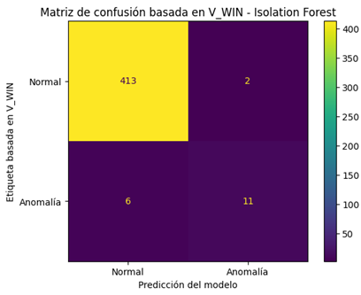

# Monitorización e IA para aerogenerador GE 1.5

Proyecto final del Curso de Especialización en Inteligencia Artificial y Big Data.

Este proyecto desarrolla una solución para capturar, procesar, visualizar y analizar datos procedentes de un aerogenerador GE 1.5. El sistema obtiene datos del PLC, procesa las señales recibidas, las almacena en CSV, las expone mediante una API, las visualiza en un dashboard desarrollado con Streamlit y aplica un modelo de inteligencia artificial para detectar comportamientos poco habituales en la generación eólica.

## Índice

1. Extracción de datos
2. Procesado del paquete
3. Creación API
4. Entrenamiento del modelo
5. Graficación de los datos
6. Conclusiones

## 1. Extracción de datos

La extracción de datos comienza con el análisis del tráfico de red entre el PLC del aerogenerador y el sistema SCADA. Para ello se utilizó Wireshark, con el objetivo de identificar qué paquetes contenían las señales útiles de la turbina.

Durante el análisis se localizaron paquetes emitidos por el PLC que contenían señales analógicas, estados del sistema y errores del aerogenerador. Una vez identificados los paquetes relevantes, se desarrolló un sistema capaz de recopilar automáticamente la información necesaria para la monitorización.

Por motivos de seguridad, este repositorio no incluye direcciones IP reales, llaves de comunicación ni capturas completas del tráfico de red.

## 2. Procesado del paquete

El paquete recibido desde el PLC llega en formato binario, por lo que no puede utilizarse directamente. Para interpretarlo, el sistema accede a posiciones concretas del paquete, llamadas offsets, donde se encuentra cada variable del aerogenerador.

Durante esta fase se extraen variables como:

- Tensiones de fase
- Potencia activa
- RPM
- Velocidad del viento
- Temperaturas
- Vibraciones
- Códigos de estado
- Códigos de error

Para el procesamiento se utilizan librerías de Python como `socket`, `struct`, `datetime`, `pandas`, `os` y `time`.

El sistema aplica controles básicos para evitar valores erróneos, como lecturas vacías, valores demasiado grandes o datos nulos. También incorpora un filtro de persistencia para evitar que un valor cero temporal sustituya inmediatamente al último valor válido.

Cada lectura procesada se almacena como una nueva fila en un archivo CSV, generando un histórico que puede utilizarse para visualización, análisis y entrenamiento de modelos.

## 3. Creación API

Para mejorar la organización del sistema y facilitar el acceso a los datos, se desarrolló una API que actúa como intermediaria entre los datos procesados y las aplicaciones que los consumen, como el dashboard de monitorización.

La API se desarrolló utilizando:

- FastAPI
- Uvicorn
- Pandas
- Pickle / Joblib

FastAPI se utilizó para construir la API y definir las rutas de consulta. Uvicorn se utilizó como servidor para ejecutar la aplicación. Pandas permitió leer y procesar los datos almacenados en CSV. Pickle o Joblib permitieron cargar modelos de inteligencia artificial previamente entrenados.

La API permite separar las distintas partes del sistema:

- Captura de datos
- Procesamiento
- Almacenamiento
- Modelos de inteligencia artificial
- Dashboard de visualización

Gracias a esta estructura, el sistema resulta más modular y fácil de mantener.

## 4. Entrenamiento del modelo

Para la detección de comportamientos anómalos en datos de generación eólica se utilizó el modelo `Isolation Forest`. El entrenamiento se realizó en Google Colab utilizando un dataset con datos diezminutales recopilados durante un mes.

Isolation Forest es un algoritmo de aprendizaje no supervisado. Se eligió porque no se disponía de etiquetas reales de fallo para cada registro del dataset. Es decir, los datos no estaban clasificados previamente como normales o anómalos.

El modelo analiza el comportamiento conjunto de variables como:

- Velocidad del viento
- Potencia activa
- Temperaturas
- Vibraciones
- Señales eléctricas

El objetivo es estudiar si la generación en kW se comporta de forma coherente respecto a las condiciones registradas en el sistema.

Una vez entrenado el modelo, se obtuvo para cada registro un score de anomalía y una etiqueta indicando si el registro se consideraba normal o anómalo.

Evaluación aproximada basada en la variable `V_WIN`:

## Matriz de confusión

La siguiente imagen muestra la matriz de confusión obtenida para el modelo Isolation Forest, utilizando como referencia aproximada los valores extremos de la variable `V_WIN`.


- Verdaderos negativos: 413
- Falsos positivos: 2
- Falsos negativos: 6
- Verdaderos positivos: 11

Estos resultados indican que el modelo clasificó correctamente la mayoría de los registros normales y detectó una parte importante de los comportamientos extremos asociados a la velocidad del viento.

## 5. Graficación de los datos

Inicialmente se comenzó a realizar la visualización mediante Grafana. Sin embargo, durante el desarrollo se comprobó que su configuración e integración requería más tiempo del previsto.

Por este motivo, se decidió utilizar Streamlit. Esta herramienta permitió desarrollar una interfaz más rápida, flexible y adaptada a las necesidades del proyecto.

El dashboard desarrollado permite visualizar:

- Tensión de red
- Potencia generada
- Velocidad del viento
- RPM
- Temperatura ambiente
- Vibración de la torre
- Temperatura del generador
- Estado del sistema

También se incorporó una sección para analizar el rendimiento, mostrando la potencia real, la potencia esperada, la diferencia entre ambas, el porcentaje de desviación y el estado calculado por el sistema.

Además, el panel incluye una gráfica temporal donde se representan conjuntamente la velocidad del viento, las RPM, la generación real y la generación esperada.

## 6. Conclusiones

Con este proyecto se ha conseguido construir un sistema completo desde cero, partiendo de un problema real: obtener, interpretar y mostrar los datos de un aerogenerador muy antiguo y con SCADA propietario.

Una de las partes más importantes del trabajo ha sido transformar paquetes binarios difíciles de interpretar en valores comprensibles como potencia, velocidad del viento, RPM, temperaturas, vibraciones y estados del sistema. Esto permitió generar un archivo CSV con datos organizados y preparados para su uso posterior.

También se desarrolló una API para consultar los datos de forma más ordenada desde otras partes del sistema. Gracias a esto, el proyecto queda mejor estructurado y resulta más fácil conectar la captura de datos, los modelos de inteligencia artificial y el dashboard.

En la parte de inteligencia artificial, el modelo Isolation Forest permitió detectar comportamientos poco habituales en los datos de generación eólica sin necesidad de disponer de etiquetas reales de fallo. Esto lo convierte en una buena aproximación inicial para analizar desviaciones de comportamiento.

La visualización mediante Streamlit permitió convertir los datos en una interfaz clara y sencilla de interpretar. En lugar de trabajar únicamente con archivos CSV o valores por consola, el dashboard permite observar la evolución de las variables principales y revisar el comportamiento del aerogenerador.

## Estructura recomendada del repositorio

```txt
aerogenerador-monitorizacion-ia/
├── README.md
├── .gitignore
├── .env.example
│
├── docs/
│   └── memoria_proyecto.pdf
│
├── captura/
│   └── captura_plc_demo.py
│
├── api/
│   └── main.py
│
├── dashboard/
│   └── app.py
│
├── modelos/
│   └── README.md
│
├── notebooks/
│   └── entrenamiento_isolation_forest.ipynb
│
├── data/
│   └── sample/
│       └── datos_demo.csv
│
└── images/
    ├── dashboard.png
    ├── matriz_confusion.png
    └── grafica_anomalias.png


## Licencia

Todos los derechos reservados. Este repositorio se publica únicamente con fines académicos y de consulta.
