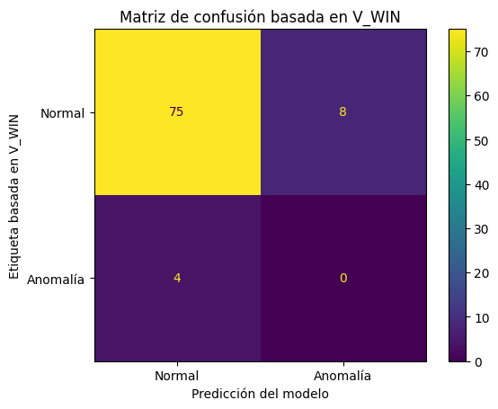

# Monitorización e IA para aerogenerador GE 1.5

Proyecto final del Curso de Especialización en Inteligencia Artificial y Big Data.

Este proyecto desarrolla una solución para capturar, procesar, visualizar y analizar datos procedentes de un aerogenerador GE 1.5. El sistema obtiene datos del PLC, procesa las señales recibidas, las almacena en CSV, las expone mediante una API, las visualiza en un dashboard desarrollado con Streamlit y aplica un modelo de inteligencia artificial basado en Random Forest Regressor para estimar la generación esperada en kW a partir de la velocidad del viento.

## Índice

1. Extracción de datos
2. Procesado del paquete
3. Creación API
4. Entrenamiento del modelo
5. Graficación de los datos
6. Conclusiones

## 1. Extracción de datos

La extracción de datos comienza con el análisis del tráfico de red entre el PLC del aerogenerador y el sistema SCADA. Para ello se utilizó Wireshark, con el objetivo de identificar qué paquetes contenían las señales útiles de la turbina.

Durante el análisis se localizaron paquetes emitidos por el PLC que contenían señales analógicas, estados del sistema y errores del aerogenerador. Una vez identificados los paquetes relevantes, se desarrolló un sistema capaz de recopilar automáticamente la información necesaria para la monitorización.

Por motivos de seguridad, este repositorio no incluye direcciones IP reales, llaves de comunicación ni capturas completas del tráfico de red.

## 2. Procesado del paquete

El paquete recibido desde el PLC llega en formato binario, por lo que no puede utilizarse directamente. Para interpretarlo, el sistema accede a posiciones concretas del paquete, llamadas offsets, donde se encuentra cada variable del aerogenerador.

Durante esta fase se extraen variables como:

- Tensiones de fase
- Potencia activa
- RPM
- Velocidad del viento
- Temperaturas
- Vibraciones
- Códigos de estado
- Códigos de error

Para el procesamiento se utilizan librerías de Python como `socket`, `struct`, `datetime`, `pandas`, `os` y `time`.

El sistema aplica controles básicos para evitar valores erróneos, como lecturas vacías, valores demasiado grandes o datos nulos. También incorpora un filtro de persistencia para evitar que un valor cero temporal sustituya inmediatamente al último valor válido.

Cada lectura procesada se almacena como una nueva fila en un archivo CSV, generando un histórico que puede utilizarse para visualización, análisis y entrenamiento de modelos.

## 3. Creación API

Para mejorar la organización del sistema y facilitar el acceso a los datos, se desarrolló una API que actúa como intermediaria entre los datos procesados y las aplicaciones que los consumen, como el dashboard de monitorización.

La API se desarrolló utilizando:

- Flask
- Flask-CORS
- Pandas
- Joblib

Flask se utilizó para construir la API y definir las rutas de consulta. Flask-CORS permitió habilitar peticiones desde el dashboard. Pandas permitió leer y procesar los datos almacenados en CSV. Joblib permitió cargar el modelo de inteligencia artificial previamente entrenado.

La API permite separar las distintas partes del sistema:

- Captura de datos
- Procesamiento
- Almacenamiento
- Modelo de inteligencia artificial
- Dashboard de visualización

Gracias a esta estructura, el sistema resulta más modular y fácil de mantener.

## 4. Entrenamiento del modelo

Para la predicción de generación eólica se utilizó un modelo `RandomForestRegressor`. El entrenamiento se realizó en Google Colab utilizando un dataset con datos diezminutales recopilados durante un mes.

El objetivo del modelo fue estimar la generación esperada en kW a partir de la velocidad del viento. Para ello, se utilizó la variable `V_WIN` como entrada principal del modelo y la variable `P_ACT` como variable objetivo, correspondiente a la potencia activa generada.

`RandomForestRegressor` es un algoritmo de aprendizaje supervisado orientado a problemas de regresión. Se eligió este modelo porque permite predecir valores numéricos continuos y porque se adapta bien a relaciones no lineales, como la relación existente entre la velocidad del viento y la potencia generada por un aerogenerador.

El modelo funciona construyendo varios árboles de decisión durante el entrenamiento. Cada árbol realiza una predicción individual y el resultado final se obtiene combinando las predicciones de todos ellos. Esto permite obtener una estimación más estable que la de un único árbol de decisión.

Antes de entrenar el modelo, se preparó el dataset en Google Colab. En esta fase se cargaron los datos, se eliminaron registros vacíos o no válidos y se seleccionaron las columnas necesarias para el entrenamiento. Posteriormente, se separaron los datos en variables de entrada y variable objetivo.

En este caso, la entrada del modelo fue:

- `V_WIN`: velocidad del viento.

La variable objetivo fue:

- `P_ACT`: potencia activa generada en kW.

Una vez entrenado el modelo, se guardó en un archivo `.pkl` para poder reutilizarlo desde la API sin necesidad de volver a entrenarlo. También se guardó el listado de variables utilizadas, asegurando que durante la predicción se empleen las mismas columnas que durante el entrenamiento.

En la integración con el sistema, la API carga el modelo entrenado y recibe los valores capturados desde el PLC. A partir de la velocidad del viento, el modelo calcula la potencia esperada en kW. Esta predicción se compara con la potencia real medida, permitiendo analizar si la generación se encuentra dentro de un comportamiento normal o si existe una desviación de rendimiento.

### Matriz de confusión

La siguiente imagen muestra la matriz de confusión obtenida para el modelo `RandomForestRegressor`, utilizando una validación simplificada basada en la comparación entre la generación real y la generación esperada.



- **Verdaderos negativos: 75**  
  Representan los casos en los que la generación real estaba dentro de lo esperado y el modelo también los clasificó como funcionamiento normal. Es decir, la potencia generada era coherente con la potencia estimada a partir del viento.

- **Falsos positivos: 8**  
  Son registros que realmente tenían una generación normal, pero el modelo los clasificó como desviación. En la práctica serían avisos preventivos o alertas innecesarias, ya que el comportamiento real no se alejaba de forma importante de lo esperado.

- **Falsos negativos: 4**  
  Son casos en los que sí existía una desviación entre la generación real y la generación esperada, pero el modelo los clasificó como normales. Esto indica que algunas desviaciones no fueron detectadas por el sistema.

- **Verdaderos positivos: 0**  
  Son los casos en los que existía una desviación real y el modelo también la detectó correctamente. En esta validación no se obtuvieron verdaderos positivos, por lo que la detección de desviaciones queda como punto de mejora.

Estos resultados indican que el modelo reconoce correctamente la mayoría de los registros normales de generación, aunque la detección de desviaciones importantes entre la potencia real y la potencia esperada debe mejorarse. Por tanto, el modelo se considera una primera aproximación válida para estimar la generación esperada en kW a partir de la velocidad del viento.

## 5. Graficación de los datos

Inicialmente se comenzó a realizar la visualización mediante Grafana. Sin embargo, durante el desarrollo se comprobó que su configuración e integración requería más tiempo del previsto.

Por este motivo, se decidió utilizar Streamlit. Esta herramienta permitió desarrollar una interfaz más rápida, flexible y adaptada a las necesidades del proyecto.

El dashboard desarrollado permite visualizar:

- Tensión de red
- Potencia generada
- Velocidad del viento
- RPM
- Temperatura ambiente
- Vibración de la torre
- Temperatura del generador
- Estado del sistema

También se incorporó una sección para analizar el rendimiento, mostrando la potencia real, la potencia esperada, la diferencia entre ambas, el porcentaje de desviación y el estado calculado por el sistema.

Además, el panel incluye una gráfica temporal donde se representan conjuntamente la velocidad del viento, las RPM, la generación real y la generación esperada.

## 6. Conclusiones

Con este proyecto se ha conseguido construir un sistema completo desde cero, partiendo de un problema real: obtener, interpretar y mostrar los datos de un aerogenerador muy antiguo y con SCADA propietario.

Una de las partes más importantes del trabajo ha sido transformar paquetes binarios difíciles de interpretar en valores comprensibles como potencia, velocidad del viento, RPM, temperaturas, vibraciones y estados del sistema. Esto permitió generar un archivo CSV con datos organizados y preparados para su uso posterior.

También se desarrolló una API para consultar los datos de forma más ordenada desde otras partes del sistema. Gracias a esto, el proyecto queda mejor estructurado y resulta más fácil conectar la captura de datos, el modelo de inteligencia artificial y el dashboard.

En la parte de inteligencia artificial, el modelo `RandomForestRegressor` permitió estimar la generación esperada en kW a partir de la velocidad del viento. Esta predicción permitió comparar la potencia real con la potencia esperada y analizar posibles desviaciones de rendimiento del aerogenerador.

La visualización mediante Streamlit permitió convertir los datos en una interfaz clara y sencilla de interpretar. En lugar de trabajar únicamente con archivos CSV o valores por consola, el dashboard permite observar la evolución de las variables principales y revisar el comportamiento del aerogenerador.

## Estructura del repositorio

```txt
├── README.md
├── .gitignore
├── requirements.txt
├── .env.example
│
├── api
│   └── api_prediccion.py
│
├── captura
│   └── monitor.py
│
├── dashboard
│
├── docs
│   └── DOCUMENTACION.docx
│
├── entrenamiento
│   └── entrenamiento_random_forest.ipynb
│
├── images
│   └── matriz_confusion_random_forest.png
│
└── recogida
    └── muestra.py

```

### 2. API de predicción

En la segunda ventana se ejecuta la API de predicción:

```bash
python api_prediccion.py
```

### 3. Dashboard

En la tercera ventana se ejecuta el dashboard:

```bash
python dashboard.py
```

Cada ventana debe permanecer abierta mientras se utiliza el sistema, ya que cada script realiza una función distinta:

- `final.py`: captura y guarda los datos del aerogenerador.
- `api_prediccion.py`: carga el modelo y devuelve la predicción de generación esperada.
- `dashboard.py`: muestra la interfaz visual con los datos y la predicción.
